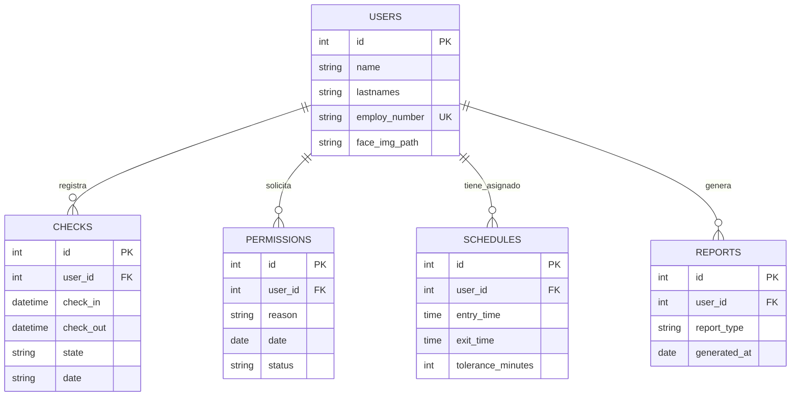

# Sistema de Control de Asistencias y Checador Biométrico

Sistema integral para el registro de asistencias con validación biométrica mediante reconocimiento facial, cálculo automático de retardos, administración de usuarios y gestión de incidencias/permisos.

---

## Arquitectura y Estructura del Proyecto

El repositorio está estructurado en módulos **Backend** (FastAPI) y **Frontend** (React Native / Expo):

```text
MI-PROYECTO/
├── backend/
│   ├── app/
│   │   ├── models/         # Modelos SQLAlchemy (check.py, permission.py, report.py, schedule.py, user.py)
│   │   ├── routes/         # Endpoints de la API (checks.py, reports.py, schedules.py, users.py)
│   │   ├── schemas/        # Esquemas Pydantic (schedule.py, user.py)
│   │   ├── utils/          # Módulos auxiliares (face_recognition.py, trainer.py)
│   │   ├── database.py     # Configuración de conexión SQLite
│   │   └── main.py         # Punto de entrada de la aplicación FastAPI
│   ├── uploads/            # Almacenamiento de fotografías registradas
│   ├── app.db              # Base de datos SQLite
│   └── requirements.txt    # Dependencias de Python
└── frontend/
    ├── src/
    │   ├── navigation/     # Configuración de rutas y navegación (AppNavigator.js)
    │   ├── screens/        # Pantallas (CheckInScreen, HistoryScreen, RegisterUserScreen)
    │   └── services/       # Cliente HTTP y llamadas API (api.js)
    ├── App.js              # Componente principal
    └── package.json        # Dependencias de React Native / Expo
```

# Esquema de la Base de Datos



# Guía de Instalación y Ejecución

# Backend (FastAPI)

1.Ingresa al directorio del backend:
        -cd backend

2.Instala las dependencias:
    -pip install -r requirements.txt

3.Inicia el servidor con tu IP local:
    -uvicorn app.main:app --host 0.0.0.0 --port 8000 --reload


# Frontend (React Native - Expo)

1.Ingresa al directorio del frontend:
    -cd frontend

2.Instala las dependencias:
    -npm install

3.Inicia el empaquetador de Expo:
    -npx expo start

# Características Principales

-Checador Biométrico: Reconocimiento y verificación facial en tiempo real.

-Control de Asistencia: Evaluación automática de estado (OK y RETARDO) según tolerancia de horario.

-Gestión de Incidencias: Módulo para registro de permisos y retardos manuales.

-Filtros e Historial: Búsqueda en tiempo real por número de empleado, nombre, fecha o estado.